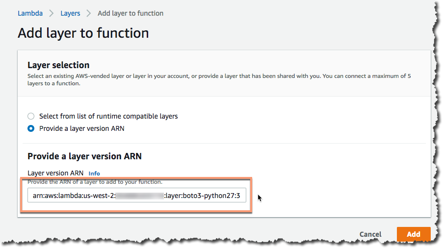

# lambda-layer-boto3

Use one of these boto3 Lambda layers when you want:

```python
>>> import boto3
>>> boto3.__version__
'{{package_version}}'
```

instead of:

```python
>>> import boto3
>>> boto3.__version__
'1.7.74'
```

## Overview

The version of boto3 available to python Lambda function is not always kept current. New services or API additions to existing services are not available to the included package. This means that normally you have to include the boto3 package and its dependencies in each and very function written. However, with the announcement of AWS Lambda Layers there are alternatives.

This repository monitors for new versions of the python boto3 package to be published on pypi. It then builds new [Lambda layers](https://docs.aws.amazon.com/lambda/latest/dg/configuration-layers.html)  and publishes them to all support AWS regions. They can be referenced from your functions to provide the latest boto3 and botocore functionality for python 2.7, 3.6, and 3.7.

For each specific python version (and one that combines all versions),  reference the public ARN when creating or modifying a new python Lambda function via the console, AWS CLI, CloudFormation template, or programmatically using an SDK. Once added, invoked Lambda functions will use the layer's version of boto3 and dependencies such as botocore.

For each version of python, there is a separate version that is published. There is also a *combined* version that contains all support versions of python, each in its own site-packages structure:

```
python
└── lib
    ├── python2.7
    │   └── site-packages
    │       ├── bin
    │       ├── boto3
    │       ├── boto3-1.9.78.dist-info
            ...
    │       ├── urllib3
    │       └── urllib3-1.24.1.dist-info
    ├── python3.6
    │   └── site-packages
    │       ├── __pycache__
    │       ├── bin
    │       ├── boto3
    │       ├── boto3-1.9.78.dist-info
            ...
    │       ├── urllib3
    │       └── urllib3-1.24.1.dist-info
    └── python3.7
        └── site-packages
            ├── __pycache__
            ├── bin
            ├── boto3
            ├── boto3-1.9.78.dist-info
            ...
            ├── urllib3
            └── urllib3-1.24.1.dist-info
```
Depending upon the python version, the specific `python/lib/pythonVERSION/` set of site-packages will be used.


## Usage

Manually, you can reference the ARN in the region where the function resides and for the python version in use. The following are examples using the python 2.7 layer in Oregon (us-west-2) with the ARN: `arn:aws:lambda:us-west-2​:123456789012:​layer:boto3-python27:3`.

### Console

When creating or modifying a Lambda, you can click on the Layers icon on the Configuration page for the function, click on Add a layer at the bottom, then provide a layer version with the ARN:



### CloudFormation

Add the Layers and ARN parameters to a function's definition in either an `AWS::Serverless:Function` or `AWS::Lambda::Function` resource type:

```yaml
Resources:
  FunctionNeedsBoto3Example:
    Type: 'AWS::Serverless::Function'
    Properties:
      CodeUri: s3://base-code-without-boto3-included/hello.zip
      Handler: lambda.handler
      Runtime: python2.7
      Layers:
        - arn:aws:lambda:us-west-2:123456789012:layer:boto3-python27:3
      Environment:
        ENV_VAR1: some_value
```

### Programmatically or CI/CD

Based on the pipeline, make a API call to return the most recent ARNs for a give region and optionally filter for a specific python/boto3 version. :bulb: Older package versions are not published in this document.

:exclamation: This feature coming soon.

Another approach is to read the `current_version.json` file and parse the contents. There is an entry for each region / python version / boto3 package version, such as in this example:

```json
{
    {
        "region": "us-east-1",
        "pythonVersion": "python2.7",
        "packageVersion": "1.2.3",
        "publicArn": "arn:aws:lambda:us-east-1:123456789012:layer:boto3-python27:3"
    },
    {
        "region": "us-east-1",
        "pythonVersion": "python3.6",
        "packageVersion": "1.2.3",
        "publicArn": "arn:aws:lambda:us-east-1:123456789012:layer:boto3-python36:42"
    },
}
```

This can be downloaded via curl or wget:

```bash
$ wget https://raw.githubusercontent.com/username/lambda-layer-boto3/master/current_version.json
$ curl -o current_version.json https://raw.githubusercontent.com/username/lambda-layer-boto3/master/current_version.json
```

or via any other way that works with direct GitHub URLs.

## Disclaimer
